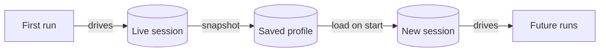

A *browser session* is a live Chromium instance Skyvern is currently driving. A *browser profile* is a frozen snapshot of cookies, localStorage, and session files you can attach to future runs to skip a login. Both exist because browser state matters and storing it costs money. By the end of this page, you should know which one to reach for in any given situation, and how the two compose into one lifecycle.

## The mental model in one diagram

A session is the *thing the browser is doing right now*. A profile is the *state snapshot* it leaves behind. You almost always create a profile from a session. You rarely create one from scratch.

## What each one actually stores

The two concepts map to two different ORM tables in `skyvern/forge/sdk/db/models.py`.

A `PersistentBrowserSessionModel` (lines 938-980) is the running container. The columns that matter for picking sessions vs profiles:

| Column | Meaning |
|---|---|
| `status` | `created`, `running`, `completed`, etc., so a session has a lifecycle. |
| `started_at`, `completed_at` | Wall-clock window the browser was alive. |
| `timeout_minutes` | How long Skyvern keeps the browser warm before tearing it down. |
| `instance_type`, `vcpu_millicores`, `memory_mb` | Compute footprint while the session is open. |
| `compute_cost`, `duration_ms` | What the session billed. |

A `BrowserProfileModel` (lines 982-998) is the snapshot metadata. It has a `name` unique per organization, a description, a source browser type, and timestamps. The archived browser state lives in artifact storage. There are no compute fields because a profile is just data sitting in storage.

The key behavioral difference: sessions cost money while they exist; profiles cost almost nothing while they sit on disk.

## When to use a session

Reach for a session when the work happens *now* and benefits from a warm browser:

- **Back-to-back tasks that share state.** A Discover task fills a search box, the next one extracts results. Sharing the same session means the second task starts on the page the first one ended on.
- **Human-in-the-loop work.** "Take Control" lets you click into the live stream, dismiss a popup, or finish a CAPTCHA, then hand control back to the agent.
- **Debugging.** Watching the live VNC stream beats post-mortem screenshots when you're trying to figure out why a step misbehaves.

Sessions can become invalid when their timeout expires, including while other work expects them. Pad your timeouts.

<Warning>
Session timeout enforcement is *passive*. A session whose `started_at + timeout_minutes` is in the past is treated as invalid the next time something asks for it (the streaming endpoint at `skyvern/forge/sdk/routes/streaming/verify.py:61-77` is the typical caller), but the underlying browser is *not* forcibly killed at the moment the timeout fires. You will see the session marked as no-longer-streamable, then it tears down on the next housekeeping pass. Don't rely on `timeout_minutes` as a hard kill switch; if you need a guaranteed cap on a long run, set the *run*'s timeout, not just the session's.
</Warning>

## When to use a profile

Reach for a profile when the work will happen *later* and you want to skip the boring parts:

- **Scheduled workflows.** A nightly run shouldn't log in from scratch every time. Bake the logged-in state into a profile and the schedule mounts it on each run.
- **Repeated automation against the same account.** Daily extraction from the same SaaS dashboard, batch invoice downloads, anything that runs on a cadence.
- **Fan-out.** One profile can back many sessions in parallel.

Profiles remain usable until the underlying cookies and session tokens expire. Some sites stay logged in for months; banks and healthcare portals may force re-auth in hours. If the agent suddenly hits a login page mid-run, refresh the profile.

## The lifecycle, end to end

The healthy pattern is profile-first. You build the profile once, then sessions become cheap and disposable.

<Steps>
  <Step title="Create a password credential with Save browser session enabled">
    On the Credentials page, add a password credential and turn on **Save browser session** with the site's login URL. See [Browser Profiles](/cloud/browser-management/browser-profiles) for the full walkthrough.
  </Step>
  <Step title="Test the credential">
    Skyvern launches a session, runs the login, and on success captures the post-login state as a profile linked to the credential. The session closes immediately after. The profile sticks around.
  </Step>
  <Step title="Reuse the profile in real runs">
    Whenever you create a new session for that credential, attach the profile under **Browser Profile** in Advanced Settings. The browser starts already logged in, no login step needed.
  </Step>
  <Step title="Refresh when the profile goes stale">
    If runs start failing on login pages, repeat step 2. The new profile replaces the old one.
  </Step>
</Steps>

## Picking rule of thumb

If you're stuck choosing, this picks for you:

| Question | Answer | Pick |
|---|---|---|
| Do I need to act in the browser right now? | Yes | Session. |
| Do I need a logged-in browser later? | Yes | Profile (loaded into a session at run time). |
| Do I want both? | Yes | Profile first, then load it into a session for the live work. |
| Will I run this on a schedule or in parallel? | Yes | Profile. Sessions don't fan out cleanly. |
| Am I just debugging one run? | Yes | Session. No need to persist the state. |

## Cost in plain English

A session bills while it's alive, regardless of whether anyone is using it, because the underlying browser container is allocated. Set `timeout_minutes` to the smallest value that fits your work, and close sessions when you're done. A profile bills almost nothing, so creating one is rarely the wrong move when you have a logged-in session in hand.

## Next steps

<CardGroup cols={2}>
  <Card
    title="Browser Sessions"
    icon="browser"
    href="/cloud/browser-management/browser-sessions"
  >
    Create, monitor, and close sessions in the Cloud UI.
  </Card>
  <Card
    title="Browser Profiles"
    icon="floppy-disk"
    href="/cloud/browser-management/browser-profiles"
  >
    Capture login state from a tested credential.
  </Card>
  <Card
    title="Browser Sessions API"
    icon="code"
    href="/developers/optimization/browser-sessions"
  >
    Programmatic session management from the SDK.
  </Card>
  <Card
    title="Browser Profiles API"
    icon="code"
    href="/developers/optimization/browser-profiles"
  >
    Create and attach profiles from code.
  </Card>
</CardGroup>
