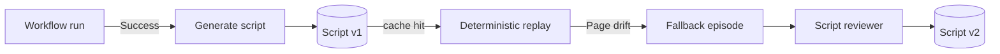

When a workflow runs successfully on a real site, Skyvern can capture what the agent did and emit it as a Playwright script you can replay deterministically. Subsequent runs that match the same shape skip the LLM and execute the script directly. This is how Skyvern makes repeatable workflows fast and cheap. By the end of this page, you'll know how scripts are produced, how cache keys decide when to use one, and how to pin, edit, or invalidate them.

## Why generated scripts exist

The agent is great when the page is unfamiliar and bad when it has to redo the same path a hundred times. A generated script is the bridge: the first run pays the LLM cost to learn the path, every later run pays roughly nothing. The LLM only re-enters the loop when the page actually changes.

The pieces:

- A **script** is a versioned bundle of files. Each version is a `ScriptModel` row (`skyvern/forge/sdk/db/models.py:1143-1257`) plus its files, blocks, and metadata.
- A **workflow script** binds a script version to a `(workflow_permanent_id, cache_key_value)` pair (`WorkflowScriptModel`). When a workflow run hashes its inputs to a cache key value Skyvern has seen succeed before, the pinned or latest script version executes instead of the agent.
- A **script block** is one workflow block compiled to a Python function. The script's `main.py` orchestrates them.
- A **fallback episode** is what gets recorded when a script can't take over a step and the agent has to step in. Fallback hits are how the script reviewer learns to fix itself.

## Lifecycle of a script



A run produces v1, real traffic surfaces fallback episodes, the reviewer turns those into v2. Pinning is the manual override that says "stop auto-promoting new versions; use this one until I change my mind."

## Triggering generation

The workflow run sets `generate_script` (column on `TaskV2Model`, runtime parameter on the v2 service) when you want a script captured. From code:

```python
result = await client.run_workflow(
    workflow_id="wpid_abc123",
    parameters={"target_url": "https://example.com"},
    generate_script=True,
    wait_for_completion=True,
)
```

When the run completes successfully, Skyvern pulls the recorded actions, screenshots, and block I/O, and emits the script's files plus per-block functions. The relevant services live at `skyvern/services/script_service.py` and `skyvern/services/workflow_script_service.py`. `SCRIPT_GENERATION_LLM_KEY` (`config.py:229-231`) controls which model handles the generation step itself.

## Replay decisions: cache keys

Two pieces decide whether a future run replays the script.

**`cache_key`** is a Jinja template defined on the workflow itself, e.g. `"{{ target_url }}"`. It declares *which* parameters define a unique replay context.

**`cache_key_value`** is what that template renders to for a given run. Two runs with the same rendered value are treated as the same replay context.

When a workflow run starts, Skyvern looks up `(workflow_permanent_id, cache_key_value)`. If a script is published for that pair, it replays. If not, the agent runs and (if `generate_script=True`) becomes the script for next time.

This is why most workflows use the *target URL* or *account ID* as a cache key. Two runs against the same login look the same; two runs against different sites do not.

### When the cache key is empty or `default`

If the workflow has no `cache_key` set, or if the rendered value comes out as the literal string `default` or empty, Skyvern auto-enriches by appending the first block's domain (`skyvern/services/workflow_script_service.py:346-360`). Two runs against `example.com` will share a cached script, runs against `acme.com` will not, even though neither workflow declared a key. For known recruiting platforms (Workday, Greenhouse, etc.) the function uses an ATS platform identifier instead of the domain, so all employers on the same platform share one cached script. The platform detector is `app.AGENT_FUNCTION.detect_ats_platform`.

If you don't want this behavior, set an explicit `cache_key` on the workflow.

### Adaptive caching ("Code 2.0") namespacing

The newer adaptive caching path appends `:v2` to whatever cache key it produces (`workflow_script_service.py:362-365`), so adaptive scripts and traditional cached scripts never collide on the same key. You'll see this in logs as `cache_key_value=https://example.com:v2`.

### Parameter changes invalidate the cache

The cache lookup keys on `(organization_id, workflow_permanent_id, cache_key_value)`, none of which change when you edit the workflow's parameter list. Without an extra check, the old cached code (which has no reference to the new parameter) would keep getting served. Skyvern guards against this by re-comparing parameter sets against the cached script and invalidating the entry if they've drifted (`workflow_script_service.py:386-401`, ticket `SKY-9254`). The next run regenerates a script that knows about the new parameter.

The implication: editing a workflow's parameters and re-running it is the supported way to force a regeneration. You don't need to clear the cache manually.

## Pinning a version

By default the latest published version is replayed. When you want to lock to one — say, you've audited v3 and don't trust auto-promotion — pin it:

```python
await client.pin_workflow_script(
    workflow_permanent_id="wpid_abc123",
    cache_key_value="https://example.com",
)
```

Endpoint: `POST /v1/scripts/{workflow_permanent_id}/pin` (`skyvern/forge/sdk/routes/scripts.py:1186-1221`). Unpin with the matching `/unpin` endpoint.

Pinning sets `WorkflowScriptModel.pinned_at` (`forge/sdk/db/models.py:1197-1230`). Once pinned, the cache lookup ignores newer versions even if they exist, so an experimental v4 won't accidentally take over production traffic.

## Deploying a new version

`POST /v1/scripts/{script_id}/deploy` (`scripts.py:537-670`) creates a new version of an existing script. You hand it a list of files (typically updated block code or `main.py`) and Skyvern:

1. Allocates the next version number.
2. Uploads each file as an artifact and records it on the new revision.
3. Copies any unchanged files from the previous revision (they share `content_hash`).
4. Re-points the script's blocks at the new files where the path matches.

The new version starts unpublished. Promote it (or pin it) when you're ready.

## The script reviewer

When a replay can't proceed because the page drifted, Skyvern records a *fallback episode* (`ScriptFallbackEpisodeModel`, `db/models.py:1298-1349`). When you've accumulated enough of those to be sure the script needs help, ask the reviewer to fix it:

```python
review = await client.review_script_with_instructions(
    workflow_permanent_id="wpid_abc123",
    workflow_run_id="wfr_xyz789",
    user_instructions="When the cookie banner appears, dismiss it before continuing.",
)
print(review.updated_blocks)
```

Endpoint: `POST /v1/scripts/{workflow_permanent_id}/review` (`scripts.py:1281-1414`). The reviewer:

- Loads the failing run's fallback episodes as context.
- Calls `SCRIPT_REVIEWER_LLM_KEY` to produce updated block code.
- Creates a new script version with the fixed blocks.
- Stores prompt and response artifacts so you can see exactly what changed.

`SCRIPT_REVIEW_DAILY_CAP` (`config.py:63`, default `5`) caps how many reviews Skyvern will perform per organization per day. Adjust if you have a large surface area.

## Clearing the cache

You'll occasionally want to throw a script away and let the agent re-learn the path — usually after a redesign. Two endpoints:

- `DELETE /v1/scripts/{workflow_permanent_id}/value` removes a single cache-key value's script binding.
- `DELETE /v1/scripts/{workflow_permanent_id}/cache` clears all cached scripts for the workflow at once (`scripts.py:1126-1173`).

Both are soft deletes against `WorkflowScriptModel` plus an in-memory cache flush. The next run with `generate_script=True` will produce a new version from scratch.

## Self-hosted gating

The `ENABLE_CODE_BLOCK` flag (`config.py:461`, default `True` self-hosted) controls whether the editor and reviewer endpoints are available. Cloud uses a PostHog feature flag (`CODE_BLOCK_ENABLED`) for the same gating; self-hosted operators don't need to think about it unless you've explicitly turned `ENABLE_CODE_BLOCK=false`.

## Next steps

<CardGroup cols={2}>
  <Card
    title="Code Caching"
    icon="bolt"
    href="/developers/features/code-caching"
  >
    The user-facing guide to enabling caching on a workflow.
  </Card>
  <Card
    title="Build a Workflow"
    icon="diagram-project"
    href="/cloud/building-workflows/build-a-workflow"
  >
    Create the workflow you'll generate scripts from.
  </Card>
  <Card
    title="Reliability Tips"
    icon="shield-check"
    href="/developers/going-to-production/reliability-tips"
  >
    Patterns that keep generated scripts robust.
  </Card>
  <Card
    title="Run from Code"
    icon="code"
    href="/cloud/building-workflows/run-from-code"
  >
    Trigger workflow runs and pass `generate_script=True`.
  </Card>
</CardGroup>
