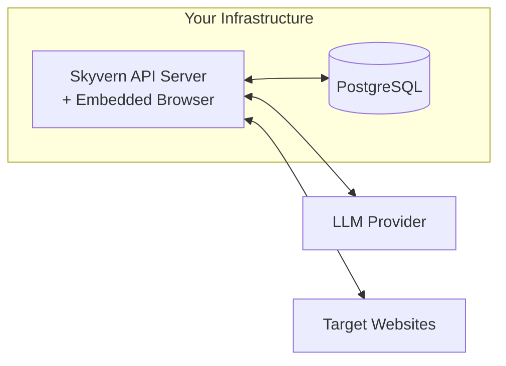

Self-hosted Skyvern runs entirely on your infrastructure: your servers, your browsers, your LLM API keys. This guide helps you decide if self-hosting fits your needs and which deployment method to choose.

## Architecture

Self-hosted Skyvern has four components running on your infrastructure:



| Component | Role |
|-----------|------|
| **Skyvern API Server** | Orchestrates tasks, processes LLM responses, stores results. Includes an embedded Playwright-managed Chromium browser that executes web automation. |
| **PostgreSQL** | Stores task history, workflows, credentials, and organization data |
| **LLM Provider** | Analyzes screenshots and determines actions. You provide the API key (OpenAI, Anthropic, Azure OpenAI, Google Vertex AI, Amazon Bedrock, Groq, OpenRouter, or local via Ollama) |

### How a task executes

Skyvern runs a perception-action loop for each task step:

1. **Screenshot**: The browser captures the current page state
2. **Analyze**: The screenshot is sent to your LLM, which identifies interactive elements and decides the next action
3. **Execute**: Skyvern performs the action in the browser (click, type, scroll, extract data)
4. **Repeat**: Steps 1-3 loop until the task goal is met or the step limit (`MAX_STEPS_PER_RUN`) is reached

This loop is why LLM choice and browser configuration are the two most impactful self-hosting decisions. They affect every task step.

## What changes from Cloud

| You gain | You manage |
|----------|------------|
| Full data control: browser sessions and results stay on your network | Infrastructure: servers, scaling, uptime |
| Any LLM provider, including local models via Ollama | LLM API costs: pay your provider directly |
| No per-task pricing | Proxies: bring your own provider |
| Full access to browser configuration and extensions | Software updates: pull new Docker images manually |
| Deploy in air-gapped or restricted networks | Database backups and maintenance |

<Note>
The most significant operational difference is **proxies**. Skyvern Cloud routes browser traffic through managed residential proxies to avoid bot detection. Self-hosted deployments need you to configure your own proxy provider.
</Note>

## Prerequisites

Before deploying, ensure you have:

<Steps>
  <Step title="Docker and Docker Compose">
    Required for containerized deployment. [Install Docker](https://docs.docker.com/get-docker/)
  </Step>
  <Step title="4GB+ RAM">
    Browser instances are memory-intensive. Production deployments benefit from 8GB+.
  </Step>
  <Step title="LLM API key">
    From OpenAI, Anthropic, Azure OpenAI, Google Gemini, or AWS Bedrock. Alternatively, run local models with Ollama.
  </Step>
  <Step title="Proxy provider (recommended)">
    For automating external websites at scale. Not required for internal tools or development.
  </Step>
</Steps>

PostgreSQL 14+ is included in the Docker Compose setup. If you prefer an external database, you can configure `DATABASE_STRING` to point to your own instance.

## Choose your deployment method

| Method | Best for |
|--------|----------|
| **Embedded (`pip install skyvern`)** | Trying Skyvern on your laptop, local prototypes, single-developer use |
| **Docker Compose** | Getting started on a server, small teams, single-host deployments |
| **Kubernetes** | Production at scale, teams with existing K8s infrastructure, high-availability requirements |

Most teams start with Docker Compose. Use the embedded path if you only need a local Skyvern to back the SDK or MCP integration; move to Docker when you want a long-running server, and to Kubernetes when you need horizontal scaling.

## Try Skyvern locally with `pip`

`skyvern quickstart` is a one-shot command that runs the interactive setup wizard, installs Playwright's Chromium, runs schema migrations, provisions a local organization, mints an API key, and brings up the API and UI. Use it to verify your machine can run Skyvern end to end before you commit to Docker or Kubernetes.

### 1. Install the package

```bash
pip install skyvern
```

The package requires Python 3.11+. If your default Python is older, use `pipx install skyvern` to keep Skyvern in an isolated environment.

### 2. Run quickstart

```bash
skyvern quickstart
```

The wizard will:

- Run `skyvern init` interactively. It asks whether to run locally or against Skyvern Cloud, sets up a Postgres database for local mode (a Docker container by default — pass `--no-postgres` or `--database-string '...'` to override), runs migrations, generates a local organization API key, and writes `DATABASE_STRING`, `SKYVERN_API_KEY`, browser settings, and `SKYVERN_BASE_URL=http://localhost:8000` into `.env` in the current directory.
- Install Playwright's Chromium (skip with `--skip-browser-install`; rerun later with `skyvern init browser`).
- Offer to start `skyvern run server` (FastAPI on `http://localhost:8000`) and `skyvern run ui` (Vite on `http://localhost:8080`) for you.

The SDK (`Skyvern.local()`) and CLI both read `.env` from the current working directory, so subsequent commands work with no extra flags.

<Note>
**No-Docker fallback.** If you skip `skyvern init` (or pass `--no-postgres` and decline the prompt), `skyvern run server` falls back to a SQLite file at `~/.skyvern/data.db` and auto-bootstraps tables, a local org, and an API key on first start, then writes `SKYVERN_API_KEY` into `.env`. `Skyvern.local()` has a separate zero-config path: it uses in-memory SQLite unless `DATABASE_STRING` is set in env, `.env`, or `settings=`.
</Note>

### 3. Verify

Hit the local API:

```bash
curl http://localhost:8000/health
# {"status":"ok"}
```

Or run a task from Python without any extra config — `Skyvern.local()` reads `.env` from the current working directory and connects to the embedded server in-process:

```python
from skyvern import Skyvern

skyvern = Skyvern.local()
result = await skyvern.run_task(
    prompt="Get the title of the top post",
    url="https://news.ycombinator.com",
    wait_for_completion=True,
)
print(result.output)
```

### `Skyvern.local()` constraints to know

- **One per process.** The embedded server is single-instance; calling `Skyvern.local()` while another embedded client is alive in the same Python process raises `RuntimeError("An embedded Skyvern client is already active in this process. Call aclose() on the existing client before creating a new one.")`. Use `await skyvern.aclose()` between embedded clients.
- **`OTEL_ENABLED` and `ENABLE_CLEANUP_CRON` cannot be passed via `settings=`.** Both require FastAPI lifespan hooks that the embedded ASGI transport does not run. Passing either through the `settings` argument raises `ValueError("Cannot override {...} in embedded mode...")`.
- **`use_in_memory_db` controls the database backend.** `None` (default) auto-detects: if `DATABASE_STRING` is set in env, `.env`, or `settings=`, it is used as-is (Postgres or whatever you point it at); otherwise embedded mode falls back to in-memory SQLite. `True` forces in-memory SQLite and rewrites `DATABASE_STRING` regardless of `.env`. `False` requires both `DATABASE_STRING` and `SKYVERN_API_KEY` to be present. Settings are snapshotted before bootstrap and restored on `aclose()`, so a mid-test failure will not leave global config in an inconsistent state.
- **Embedded mode does not start a public port.** Requests are served over an in-process ASGI transport, so other processes cannot reach this Skyvern. Run `skyvern run server` if you need an HTTP-reachable instance.

### 4. Move to managed Postgres or S3 when you outgrow it

By default, `skyvern quickstart` provisions a Docker Postgres container and stores artifacts on local disk. To move to a managed Postgres and S3, point `.env` at the new endpoints and restart the server:

```bash
DATABASE_STRING=postgresql+psycopg://skyvern@db.example.com:5432/skyvern
SKYVERN_STORAGE_TYPE=s3
AWS_REGION=us-east-1
AWS_S3_BUCKET_ARTIFACTS=my-skyvern-artifacts
```

The same env file is what Docker Compose reads, so a successful local run carries over with no further changes. See [Storage Configuration](/developers/self-hosted/storage) for the full storage matrix and [Docker Setup](/developers/self-hosted/docker) for the multi-host story.

## Next steps

<CardGroup cols={2}>
  <Card title="Docker Setup" icon="docker" href="/developers/self-hosted/docker">
    Get Skyvern running in 10 minutes with Docker Compose
  </Card>
  <Card title="LLM Configuration" icon="brain" href="/developers/self-hosted/llm-configuration">
    Wire up OpenAI, Anthropic, Bedrock, Gemini, Ollama, or any OpenAI-compatible endpoint
  </Card>
  <Card title="Kubernetes Deployment" icon="dharmachakra" href="/developers/self-hosted/kubernetes">
    Deploy to production with Kubernetes manifests
  </Card>
  <Card title="Storage Configuration" icon="database" href="/developers/self-hosted/storage">
    Move artifacts off local disk to S3 or Azure Blob
  </Card>
</CardGroup>
