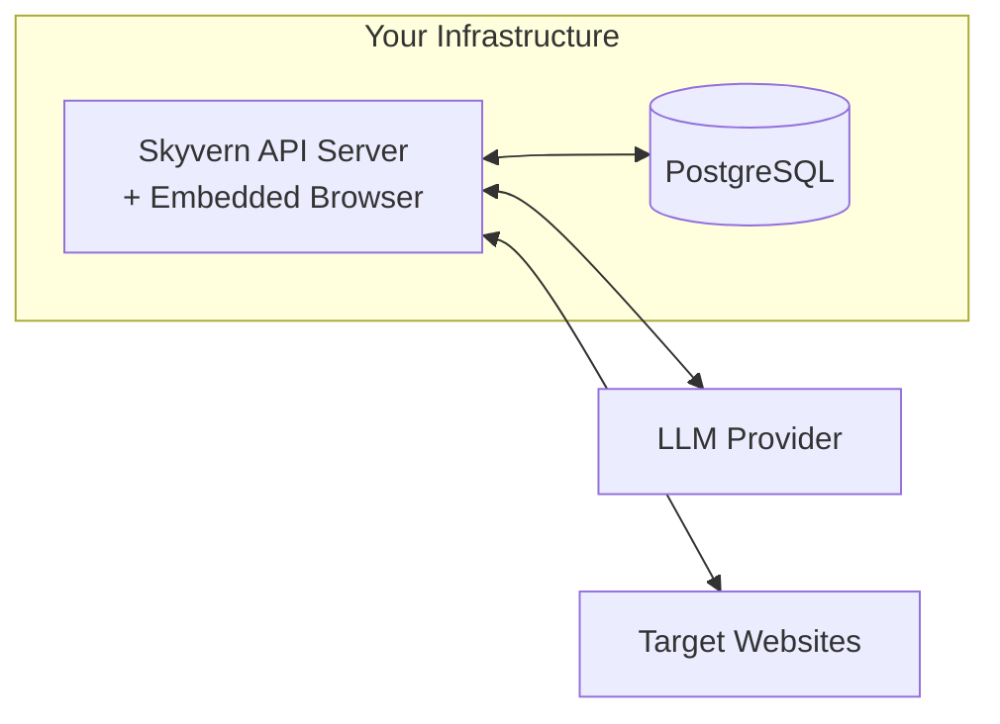

Self-hosted Skyvern runs entirely on your infrastructure: your servers, your browsers, your LLM API keys. This guide helps you decide if self-hosting fits your needs and which deployment method to choose.

## Architecture

Self-hosted Skyvern has four components running on your infrastructure:

| Component | Role |
|-----------|------|
| **Skyvern API Server** | Orchestrates tasks, processes LLM responses, stores results. Includes an embedded Playwright-managed Chromium browser that executes web automation. |
| **PostgreSQL** | Stores task history, workflows, credentials, and organization data |
| **LLM Provider** | Analyzes screenshots and decides each action. You bring the API key. See the [provider matrix](#supported-llm-providers) below for everything Skyvern supports. |

### How a task executes

Skyvern runs a perception-action loop for each task step:

1. **Screenshot**: The browser captures the current page state
2. **Analyze**: The screenshot is sent to your LLM, which identifies interactive elements and decides the next action
3. **Execute**: Skyvern performs the action in the browser (click, type, scroll, extract data)
4. **Repeat**: Steps 1-3 loop until the task goal is met or the step limit (`MAX_STEPS_PER_RUN`) is reached

This loop is why LLM choice and browser configuration are the two most impactful self-hosting decisions. They affect every task step.

## What changes from Cloud

| You gain | You manage |
|----------|------------|
| Full data control: browser sessions and results stay on your network | Infrastructure: servers, scaling, uptime |
| Any LLM provider, including local models via Ollama | LLM API costs: pay your provider directly |
| No per-task pricing | Proxies: bring your own provider |
| Full access to browser configuration and extensions | Software updates: pull new Docker images manually |
| Deploy in air-gapped or restricted networks | Database backups and maintenance |

<Note>
The most significant operational difference is **proxies**. Skyvern Cloud routes browser traffic through managed residential proxies to avoid bot detection. Self-hosted deployments need you to configure your own proxy provider.
</Note>

## Prerequisites

Before deploying, ensure you have:

<Steps>
  <Step title="Docker and Docker Compose">
    Required for containerized deployment. [Install Docker](https://docs.docker.com/get-docker/)
  </Step>
  <Step title="4GB+ RAM">
    Browser instances are memory-intensive. Production deployments benefit from 8GB+.
  </Step>
  <Step title="LLM API key">
    From OpenAI, Anthropic, Azure OpenAI, Google Gemini, or AWS Bedrock. Alternatively, run local models with Ollama.
  </Step>
  <Step title="Proxy provider (recommended)">
    For automating external websites at scale. Not required for internal tools or development.
  </Step>
</Steps>

PostgreSQL 14+ is included in the Docker Compose setup. If you prefer an external database, you can configure `DATABASE_STRING` to point to your own instance.

## Choose your deployment method

| Method | Best for |
|--------|----------|
| **Docker Compose** | Getting started, small teams, single-server deployments |
| **Kubernetes** | Production at scale, teams with existing K8s infrastructure, high availability requirements |
| **Embedded (`Skyvern.local()`)** | Scripts and notebooks. Boots Skyvern in your Python process. See [SDK overview → Local mode](/sdk-reference/overview#local-mode). |

Most teams start with Docker Compose. It's the fastest path to a working deployment. Move to Kubernetes when you need horizontal scaling or want to integrate with existing orchestration infrastructure. Embedded mode is for code that wants Skyvern in-process, not as a separate service.

## Supported LLM providers

Every provider lives on a single page, [LLM Configuration](/developers/self-hosted/llm-configuration). The matrix below is your shortcut into it: each row links to the section with the env vars and recommended `LLM_KEY` for that provider.

| Provider | Recommended `LLM_KEY` | Notes |
|----------|----------------------|-------|
| [OpenAI](/developers/self-hosted/llm-configuration#openai) | `OPENAI_GPT5_5` | Default for new self-hosted installs. GPT-5 family + o-series reasoning models. |
| [Anthropic](/developers/self-hosted/llm-configuration#anthropic) | `ANTHROPIC_CLAUDE4.7_OPUS` | Most capable for hard pages. Claude 3 → 4.7 family supported. |
| [Azure OpenAI](/developers/self-hosted/llm-configuration#azure-openai) | `AZURE_OPENAI` (custom deployment) | Use when GPT-4/5 must run in your Azure tenant. |
| [Google Gemini](/developers/self-hosted/llm-configuration#google-gemini) | `GEMINI_3_PRO` | Direct Gemini API. Cheapest path to Google models. |
| [Vertex AI](/developers/self-hosted/llm-configuration#vertex-ai) | `VERTEX_GEMINI_3_PRO` | Gemini through your GCP project + service account. |
| [Amazon Bedrock](/developers/self-hosted/llm-configuration#amazon-bedrock) | `BEDROCK_ANTHROPIC_CLAUDE4.7_OPUS_INFERENCE_PROFILE` | Claude through your AWS account, plus Amazon Nova. |
| [MiniMax](/developers/self-hosted/llm-configuration#minimax) | `MINIMAX_M2_5` | Vision-capable, China-region inference. |
| [VolcEngine (Doubao)](/developers/self-hosted/llm-configuration#volcengine-bytedance-doubao) | `VOLCENGINE_DOUBAO_SEED_1_6` | ByteDance Doubao with vision. |
| [Novita](/developers/self-hosted/llm-configuration#novita) | `NOVITA_LLAMA_3_2_11B_VISION` | Open-source models (DeepSeek, Llama) with vision options. |
| [Moonshot](/developers/self-hosted/llm-configuration#moonshot) | `MOONSHOT_KIMI_K2` | Long-context Kimi models. |
| [Inception](/developers/self-hosted/llm-configuration#inception) | `INCEPTION_MERCURY_2` | Mercury series. |
| [Ollama](/developers/self-hosted/llm-configuration#ollama-local-models) | `OLLAMA` | Run open-source models locally. Most aren't vision-capable. |
| [OpenRouter](/developers/self-hosted/llm-configuration#openrouter) | `OPENROUTER` | Single key, dozens of models. |
| [Groq](/developers/self-hosted/llm-configuration#groq) | `GROQ` | Fastest inference for open-source models. |
| [OpenAI-compatible](/developers/self-hosted/llm-configuration#openai-compatible-endpoints) | `OPENAI_COMPATIBLE` | LiteLLM, vLLM, LocalAI, anything that speaks the OpenAI API. |

Pick one provider to start. You can add `SECONDARY_LLM_KEY` later for cheaper sub-agent calls; see the [multiple-models guide](/developers/self-hosted/llm-configuration#using-multiple-models).

## Next steps

<CardGroup cols={2}>
  <Card title="Docker Setup" icon="docker" href="/developers/self-hosted/docker">
    Get Skyvern running in 10 minutes with Docker Compose
  </Card>
  <Card title="Kubernetes Deployment" icon="dharmachakra" href="/developers/self-hosted/kubernetes">
    Deploy to production with Kubernetes manifests
  </Card>
</CardGroup>
